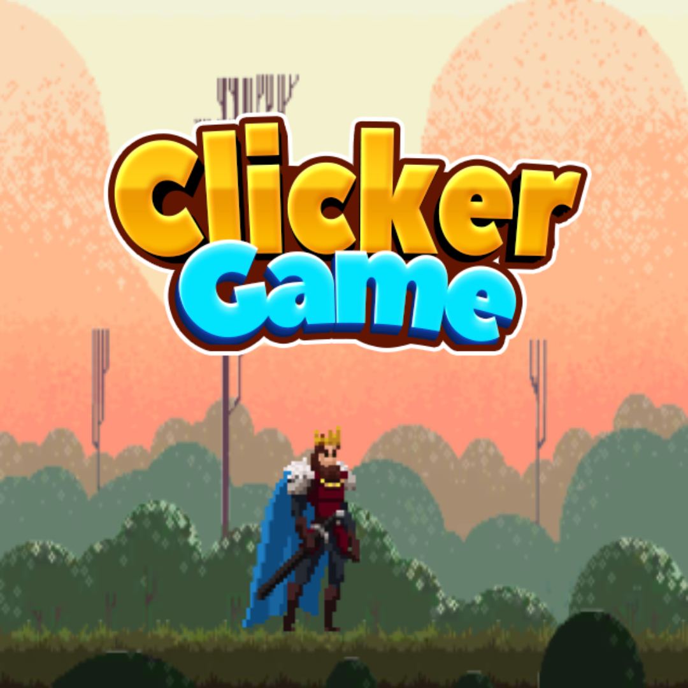
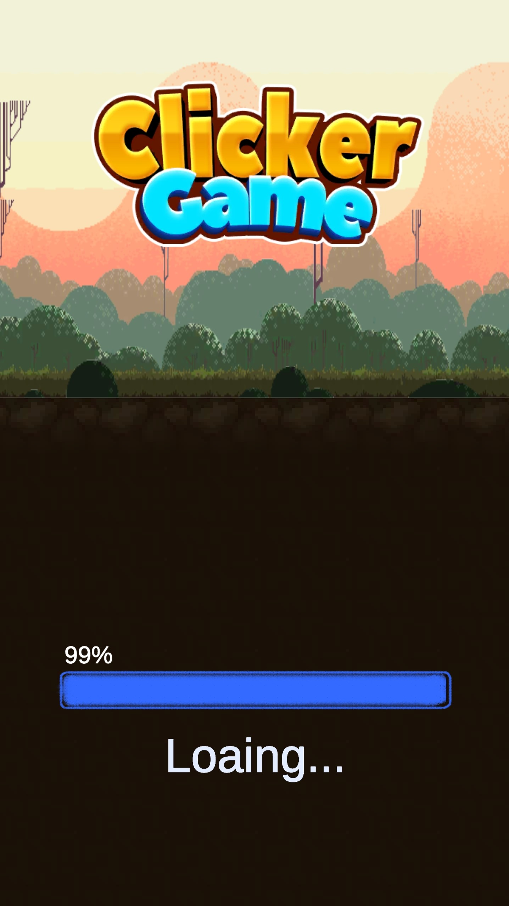
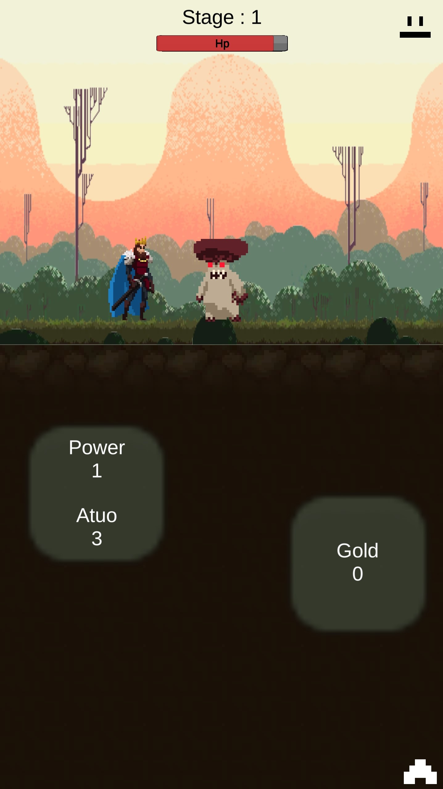
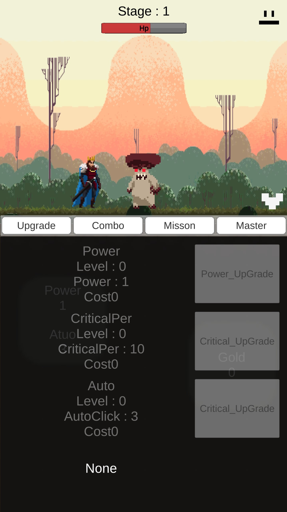
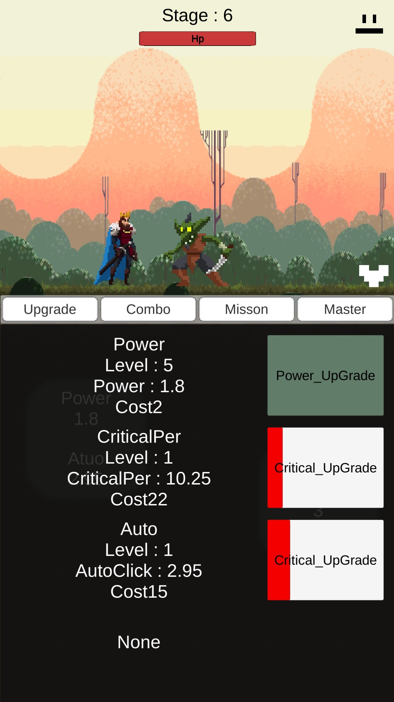
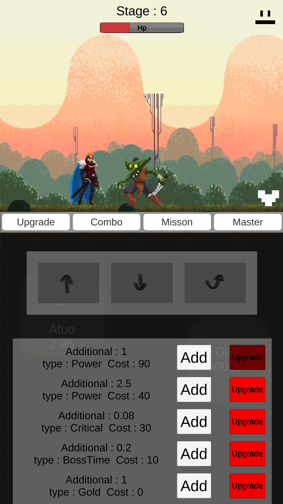
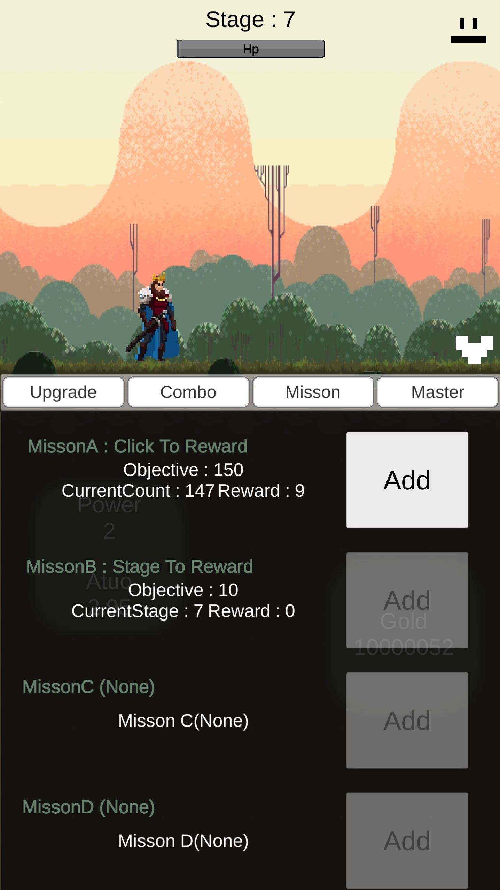
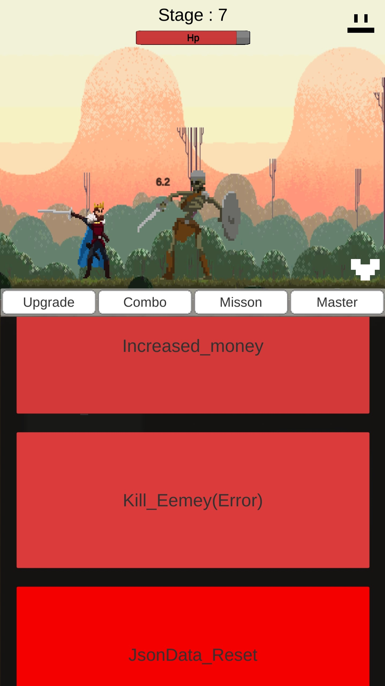

# Clicker Game
> 목차

 ○ [게임소개](#Infomation)  
 ○ [게임화면](#게임화면)   
 ○ [사용기술](#사용한-기술-및-배운점)  
 ○ [개선점](#개선점)

___
> ## Infomation
  

|||
|:--:|:--|
|이름|Clicker Game|
|설명|앞으로 진행하며 나오는 몬스터들을 잡아 능력치를 올리는 흔히 생각하는 클리커게임이다.|
|특징|공격모션(5가지)들이 각각 다른 특징를 가지고 있다는 점이다. 또한 이 모션을 절적히 배치해서 또 다른 추가 효과를 얻을 수 있다.|
|제작기간| 20년12월22일 ~ 21년02월23일 (56일)|
|초기목표|단순한 클릭게임이지만 액션의 화려함과 다양한 공격모션 구현으로 인한 뻔한 클리커게임 벗어나는 것이 목표, 하지만 원하는데로 이루어지지 않았다.|
|에셋|모든 에셋들은 Unity Asset Store에서 사용 (상업적으로 사용하지 않음)|
|자세한 제작과정|[DevRecord 파일 확인](https://github.com/Goaway-1/My-Clicker-Game/blob/main/DevRecord.md)|
|다운로드 링크|[구글 드라이브](https://drive.google.com/file/d/1wtfZB9dNxa4Bv-HKaRZXgeAvQvcxIDal/view?usp=sharing) // 플레이스토어에 등록X (저작권 관련)|
___
> <a name="test">게임화면</a>
   
  

  <input type="radio" name="pos" id="pos1" checked>
  <input type="radio" name="pos" id="pos2">
  <input type="radio" name="pos" id="pos3">
  <input type="radio" name="pos" id="pos4">
  <input type="radio" name="pos" id="pos5">
  <input type="radio" name="pos" id="pos6">
  <input type="radio" name="pos" id="pos7">
  <input type="radio" name="pos" id="pos8"> 
  <ul>
    <li>
    

    - 메인화면이며 json 파일의 로딩과 페이크로딩을 사용하여 진행했다.
    </li>
    <li>

    - 로딩이 모두 끝난후의 화면으로 본격적으로 게임을 즐길수 있는 화면이다. 
    - 단순히 화면을 클릭하면 몬스터를 공격하는 방식이다. 
    - 단점 : 초기에는 공격모션이 지정되어 있지 않아 모션이 나오지 않는다. Combo창에 가서 모션을 지정해 주어야한다.</li>
    <li>

    - 기본 공격력, 크리티컬 확률, 자동 클릭 3가지를 업그레이드 할 수 있는 UI이다.
    </li>
    <li>

    - 업그레이드 가능 : 녹색, 업그레이드 불가 : 빨간색 
    - 오른쪽 상단은 오디오의 뮤트,언뮤트이다.
    </li>
    <li>

    - 공격모션을 추가하고 업그레이드 할 수 있는 UI 
    - 공격모션의 순서에 따라 숨겨진 추가 데미지 존재
    </li>
    <li>

    - Misson을 진행하고 그에 대한 보상을 받을 수 있는 UI 
    - 클릭 횟수와 스테이지별 보상이 존재하며, 한번에 받을 수 있는 기능은 없다. 
    </li>
    <li>

    - Master UI는 실험할때 사용하는 창이다.  
    - 게임머니를 추가할때 Increased_Money 버튼을, 몬스터를 죽일때는 Kill_Enemy를, 데이터의 초기화를 원하는 경우에는 JsonData_Reset 버튼을 사용한다. 
    - Kill_Enemy버튼은 오류가 발생할 수 있으니 되도록 사용하지 않는것이 좋다.
    </li>
    <li>
    - 플레이화면</li>
  </ul>
  

    <label for="pos1">1</label>
    <label for="pos2">2</label>
    <label for="pos3">3</label>
    <label for="pos4">4</label>
    <label for="pos5">5</label>
    <label for="pos6">6</label>
    <label for="pos7">7</label>
    <label for="pos8">8</label>
  

___
> ## 사용한 기술 및 배운점
  
  &nbsp; 1. 오브젝트 폴링

    
  &nbsp; &nbsp;&nbsp;&nbsp; - 가비지(쓰레기)값을 줄이기 위해 사용

    
  &nbsp; &nbsp;&nbsp;&nbsp; - 데미지를 출력하는 부분에서 사용  

  
  &nbsp;2. 싱글톤

    
  &nbsp; &nbsp;&nbsp;&nbsp; - DataManager와 같이 통제하는 역할을 갖는 .cs파일에서 사용

    
   &nbsp; &nbsp;&nbsp;&nbsp; - 과도한 사용은 하지 않았다. 

  
  &nbsp;3. json활용법  

    
  &nbsp; &nbsp;&nbsp;&nbsp; - Json을 활요해서 데이터를 저장

    
  &nbsp; &nbsp;&nbsp;&nbsp; - 또한 비트로 전환하므로써 일반인들이 건들일수게 보안 강화 

  
 &nbsp; 4. 전처리기

    
  &nbsp; &nbsp;&nbsp;&nbsp;- 문법 습득   

  
 &nbsp; 5. 최적화 관련 작업 (profiler 사용법...)

    
  &nbsp; &nbsp;&nbsp;&nbsp; - update를 많이 사용하면 안되는것으로 알고 있음

    
  &nbsp; &nbsp;&nbsp;&nbsp; - Profiler를 통해서 확인은 가능했지만 최적화는 많이 이루어져 못했다.

___
> ## 개선점
  
 &nbsp;&nbsp;- 업그레이드 비용의 밸런스

  
 &nbsp;&nbsp;- 애니메이션의 최적화

  
 &nbsp;&nbsp;- Json배열 사용법

  
 &nbsp;&nbsp;- NGUI의 개선 

  
 &nbsp;&nbsp;- 스킬다양화(밸런스), json의 배열, 몬스터 오브젝트 풀링, 부활(0.12버전에서 할 예정)

