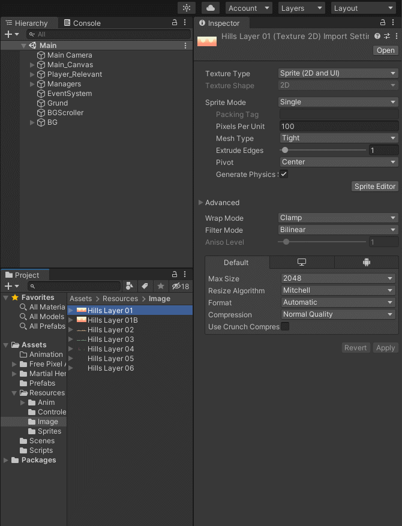
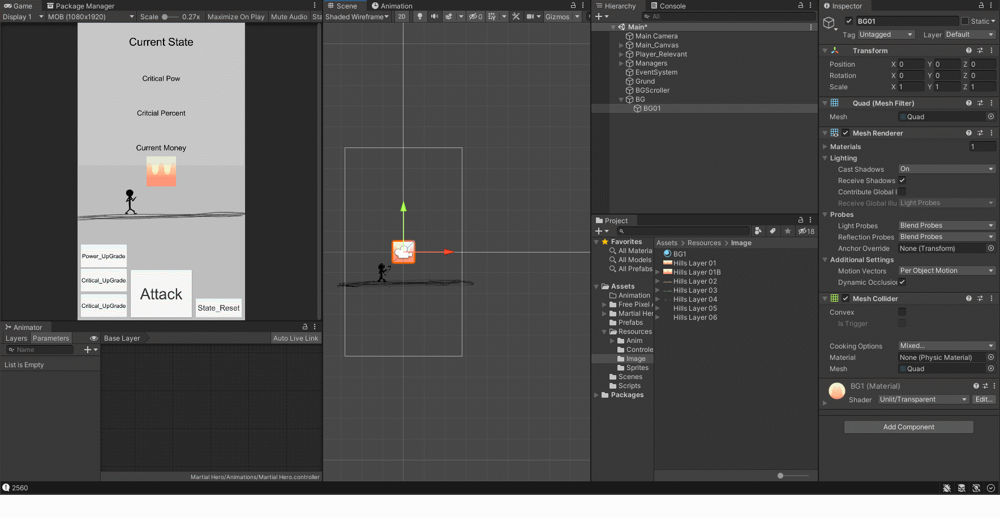
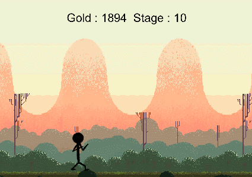
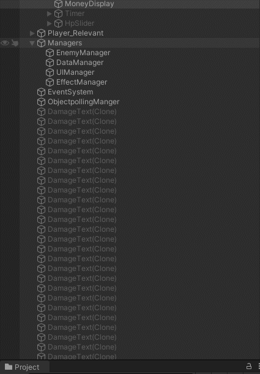
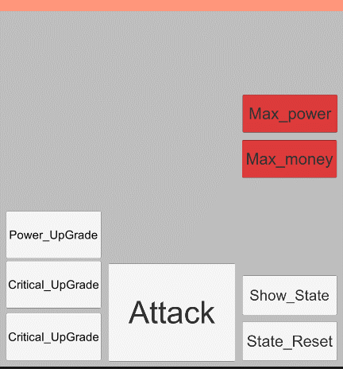
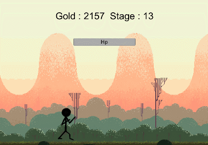
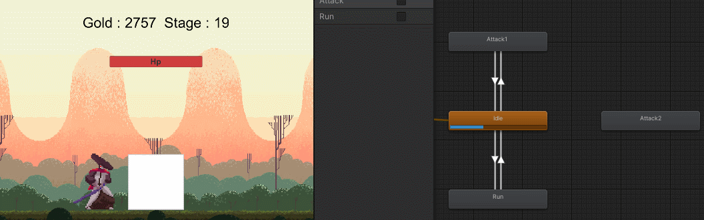

# Dev Story

## Description for Dev Stroy
`Expain My third project and I want to make use of various tools useful. :)`
___

## __12.22__
> **<h3>Today Dev Story</h3>**
 - 클리커게임을 위해 클릭, 돈, 클릭per돈 등을 구현만 해두었다.
 - PlayerPrefabs.SetInt() 와 PlayerPrefabs.GetInt()를 통해서 local에 저장했다. 작은 메모리에서만 사용가능하니 <ins>Json으로 추후 변경해야한다.</ins> 
 - 오후에는 [수업](https://www.youtube.com/watch?v=5obCdTnlEFo)을 모두 듣고 나만의 것을 따로 만들어 구현할 것이다.

> **<h3>Realization</h3>**
- 싱글톤에 대해서 배웠다. 하나의 스크립트를 다른 스크립트에서 사용할때 아래 방식처럼 매 스크립트를 호출해서 사용하거나
```
public Manager manager; 
manager.~~();
``` 
- 또는 사용할 스크립트에 들어가서 static으로 <mark>__싱글톤화__</mark> 해준 후 사용해도 된다. 싱글톤을 사용하면 편리하게 다른 스크립트 내용을 불러올 수 있어 간편하지만 남용하면 접근성에 있어 약점을 보이게 된다. 

```
private static Manager instance;
  public static Manager GetInstance()
  {
	if(instance == null)
	{
	    instance = FindObjectOfType<Manager>();
	    if(instance == null)
	    { 
 	  	GameObject container = new GameObject("Manager");
	  	instance = container.AddComponent<Manager>();
    	}
	}
	return instance;
  }
```
___
## __12.23__
> **<h3>Today Dev Story</h3>**
 - 프로젝트를 제작하기 시작했다.
 - Enemy, Player, itemButton, DataManager, UIManger를 구현
 - 공격버튼시 강제로 돈이 추가된다는 점과 적 생성에 있어 오류 ~~(수정필요)~~
 - 깃허브를 활용해서 저장하여 제작 과정을 기록
 - Playerfabs에 사용될 데이터(Power,Critical....)들의 정보들을 정리하지 못함
> **<h3>Realization</h3>**
 - NULL
___
## __12.24__
> **<h3>Today Dev Story</h3>**
  - EnemyManager를 수정해서 죽고 2초 뒤에 생성 <ins>(수정필요)</ins> 
  - Player, Enemy 두가지 데이터의 상태들을 제작, power업그레이드를 완벽하게 구현
  - power표시 오류 수정 및 PlayerState를 싱글톤화 하지 않고 DataManager에서 할당해서 사용 
  - stage별 enemy 체력 상승에 대한 문제발생 -->  EnemyManager에서 관리필요 (stage대비)
  - player에서 enemy의 피를 깍기 위해서 enemymanager를 거치게 하고 싶다. <ins>(수정필요)</ins> 
> **<h3>Realization</h3>**
 - NULL
___
## __12.25__
> **<h3>Today Dev Story</h3>**
 - Critcal (Pow,Per) 2가지를 Random.Range()함수로 구현하려 했으나, 더욱 확실하게 구현하기 위해서 __<mark>"의사 난수 알고리즘"</mark>__ 을 학습
> **<h3>Realization</h3>**
 - LCG(선형 합동법)이 대표적이며 이외에도 Mersenne Twister, PCG, xoroshro가 존재
   - __선형 합동법(LCG)__   
장점 : 로컬 시간을 이용하여 계산하며, 공식이 쉽고 빠름, 또한 적은 메모리로 구현가능  
단점 : 1차원은 괜찮지만 n차원이상은 일정 패턴이 보여 플레이어가 예측가능하게 된다.

   - __메르센 트위스터(Mersenne Twister)__     
장점 : 주기가 길며, 다른 생성기의 결점들을 고려해서 만들었다. 그렇기에 동일분포률을 갖는다.(n차원이 623차원까지)  
단점 : 구현에 있어 복잡함
___
## __12.26__
> **<h3>Today Dev Story</h3>**
 - 메르센 트위스터와 XOR 스프트를 구하려 했으나 시간을 사용하는 LCG를 사용 
 - C#은 구현방식이 달라 다시 학습 필요
> **<h3>Realization</h3>**
 - NULL
___
## __12.27__
> **<h3>Today Dev Story</h3>**
 - NULL
> **<h3>Realization</h3>**
 - NULL
___
## __12.28__
> **<h3>Today Dev Story</h3>**
 - 유니티에서 의사난수 알고리즘 필요 X -> <ins>Random.range()</ins>사용
 - 모든 Player State를 float형으로 전환
 - Player 애니메이션 idle, attack만 보기 쉽게 구현
 - 공격은 IEnumerator를 통해서 return new waitforsecond()를 통해 대기 시간 후 자동으로 공격 모션의 bool값을 false로 변환, 임시 방편일 뿐이다. <ins>(수정필요)</ins> 
 - random.range() 함수를 float형으로 반환하기 위해서 2가지 대안
   1. 두 가지 정수를 받고 첫번째 수에서 두번째 수를 서로 나누어 나오는 값, 하지만 작은 수의 분포가 더 높다.
   2. 두 가지의 정수를 받아 두 번째 수를 소수점으로 변경 후 두 수를 더하는 방식

> **<h3>Realization</h3>**
 - NULL
___

## __12.29__
> **<h3>Today Dev Story</h3>**
 - power,critical등의 변수들을 float형으로 전환
 - Buttons 클래스를 만들고 상속을 통해서 모든 버튼(Power, Critical)을 상속, ~~미완성~~
> **<h3>Realization</h3>**
 - NULL
___
## __12.30__
> **<h3>Today Dev Story</h3>**
 - 몬스터 사망 판단 수정 (Update로 이동) 및 공격 수정
 - Buttons 상속 구현 완성, 크리티컬 확률과 퍼센트 버튼 생성 및 상속사용
 - 몬스터의 등장을 구현 <ins>(추후 수정)</ins>
 - 인터페이스 구상 및 재현
> **<h3>Realization</h3>**
- 이동에 대해 4가지 학습, MoveToWards를 활용해서 몬스터의 등장을 구현
  1. Vector3.MoveToWards(transform.postion, target_pos, speed) : 일정한 속도로 이동
  2. Vector3.SmoothDamp(transform.postion, target_pos, ref velo, speed) : 부드러운 이동. 마지막 레퍼런스에 반비례해서 속도 증가//Vector3 velo = Vector3.zero; (참조값)
  3. Vector3.Lerp(transform.postion, target_pos, speed) : 부드러운 이동, smoothDamp보다 감속이 길다.
  4. Vector3.SLerp(transform.postion, target_pos, speed) : 호를 그리며 이동


## __12.31__
> **<h3>Today Dev Story</h3>**
 - readme 파일 수정을 위한 markdown 학습 
 - 내일은 일기를 다시 갱신 예정
> **<h3>Realization</h3>**
 - visual studio code를 통해서 작성, HTML과 비슷한 구조
 - 개발자 각자의 메모장이라는 개념

___
__<h2>Happy New Year!!</h2>__

#### 이제 24살이여 

___
## __1.1__
> **<h3>Today Dev Story</h3>**
 - Dev Story 작성 및 수정
> **<h3>Realization</h3>**
 - NULL

___
## __1.2__
> **<h3>Today Dev Story</h3>**
- 모니터 와서 못했엉.
> **<h3>Realization</h3>**
 - NULL
___
## __1.3__
> **<h3>Today Dev Story</h3>**
- 몬스터 다가 올때만 배경 추가 및 움직임 구현
- EnemyManager에서 Instantiate사용시 0.85초간 이동하게 만듬 <ins>(추후 수정)</ins>
- 한번만 이동하고 다시 이동하지 않는다. ~~<ins>(추후 수정)</ins>~~
  ```c#
  void Update()
	{
    if (EnemyManager.GetInstance().isMove)  //isMove가 true일때만 배경을 움직인다.
		{
			Move();
		}
        else
        {
			currentTime = 0;
        }

		if (currentTime >= MoveTime && EnemyManager.GetInstance().isMove)	//일정 시간이 지나면 배경을 정지한다. 
		{
			EnemyManager.GetInstance().isMove = false;
		}
	}
  ```

- boss 출현시 timer 작동(EnemyManager에서 UIManager의 DecreaseTime()호출) <ins>(추후 수정)</ins>
```c#
    public void DecreaseTime()  //시간 감소
    {
        Slider.SetActive(true);
        StartCoroutine(wait());
    }
    public IEnumerator wait()
    {
        while (currentTime >= 0)
        {
            currentTime -= Time.deltaTime;
            timeSlider.value = currentTime / MaxTime; //출력
            yield return new WaitForFixedUpdate();
            Debug.Log(currentTime);
        }
        if(currentTime <= 0)
        {
            Slider.SetActive(false);  //비활성화
        }
    }
```
- 10stage마다 boss출현 (제한 시간내에 잡지 못하면 다시 n번째 스테이지로 돌아간다.) <ins>(추후 수정)</ins>


> **<h3>Realization</h3>**
 - 배경을 움직이는 방법 2가지
 1. n개의 배경을 만들어 놓고 transform.postion을 이동시켜 교차하면서 사용하기
> 결과


```c#
public class MoveBackground : MonoBehaviour 
{
	public float speed;
	private float x;
	public float PontoDeDestino;
	public float PontoOriginal;

	void Start () {
		//PontoOriginal = transform.position.x;
	}
	
	void Update () {
		x = transform.position.x;
		x += speed * Time.deltaTime;
		transform.position = new Vector3 (x, transform.position.y, transform.position.z);

		if (x <= PontoDeDestino){
			x = PontoOriginal;
			transform.position = new Vector3 (x, transform.position.y, transform.position.z);
		}
	}
}
```

1. Material을 이용해서 TextureOffset을 이용해 그림 자체의 offsetX를 이동시키기 {이미지를 default 변환 및 Martial 생성(shader -> Unlit/Transparent로 설정)}

> Material 설정방법


> 결과


```c#
[System.Serializable]
public class BGScrollData
{
    public Renderer RenderForScroll;
    public float Speed;
    public float OffsetX;
}

public class BGScroller : MonoBehaviour
{
    [SerializeField]
    BGScrollData[] ScrollDatas;

    void Update()
    {
        updateScroll();
    }

    void updateScroll()
    {
        for (int i = 0; i < ScrollDatas.Length; i++)
        {
            SetTextureOffset(ScrollDatas[i]);
        }
    }

    void SetTextureOffset(BGScrollData scrollData)
    {
        //값들을 증가 시킨다.
        scrollData.OffsetX += (float)(scrollData.Speed) * Time.deltaTime;
        if(scrollData.OffsetX > 1)
        {
            scrollData.OffsetX = scrollData.OffsetX % 1.0f;
        }
        Vector2 offset = new Vector2(scrollData.OffsetX, 0);

        //텍스쳐 이동
        scrollData.RenderForScroll.material.SetTextureOffset("_MainTex", offset);
    }
}
```
- 나는 1번안을 통해서 사용했다. (이유 : 이미지의 offsetX값을 수정하기엔 이미지가 이상있어서)
___
## __1.4__
> **<h3>Today Dev Story</h3>**
 - 배경 이동 속도 및 한번만 이동하는 오류 수정.
 - 타이머 작동 중 몬스터(보스)가 죽으면 종료, 죽지 않았다면 스테이지를 하락
 - 타이머할때만 slider.setative 활성화

```c#
 public void DecreaseTime()  //시간 감소
    {
        Slider.SetActive(true);
        StartCoroutine(wait());
    }
    IEnumerator wait()   //시간 감소를 위한 대기시간을 위해 만듦
    {
        while (currentTime >= 0)
        {
            currentTime -= Time.deltaTime;
            timeSlider.value = currentTime / MaxTime; //출력
            yield return new WaitForFixedUpdate();  //프레임 대기
            if (!EnemyManager.GetInstance().getExist()) //몬스터 뒤짐
            {
                break;
            }
        }
        if (EnemyManager.GetInstance().getExist()) //몬스터 뒤지지 않았다면 삭제후, 스테이지 초기화
        {   
            Enemy.GetInstance().ifdead();
            DataManager.GetInstance().DecreaseStage();
        }
        Slider.SetActive(false);
        currentTime = 10f;
    }
```
 - 공격시 데미지를 텍스트로 띄우기 위해서 text를 사용하려 했으나 기존 text는 panel위에서 사용해야하기 때문에 3D에 있는 3D Text를 사용 
 - 동시에 오브젝트 풀링을 사용해서 최적화

```c#
  ///ObjectPooling 기획
  public static ObjectPoolingManager instance;

  public GameObject m_goPrefab = null;    //여기에 텍스트가 들어간다.
  public Queue<GameObject> m_queue = new Queue<GameObject>(); //저장시킬 큐(장소)

  void Start()
  {
    instance = this;

    for (int i = 0; i < 100; i++)
    {
      GameObject t_object = Instantiate(m_goPrefab, Vector3.zero, Quaternion.identity);   //프리펩을 게임내의 객체로 생성한뒤 큐에 저장
      m_queue.Enqueue(t_object);
      t_object.SetActive(false);
    }
  }

  public void InsertQueue(GameObject p_object) //사용한 객체를 풀에 반납하는 함수
  {
    m_queue.Enqueue(p_object);
    p_object.SetActive(false);
  }

  public GameObject GetQueue()    //풀에서 객체를 불러와 사용하는 함수
  {
    GameObject t_object = m_queue.Dequeue();
    t_object.SetActive(true);
    return t_object;
  }
```
```c#
//effect Manager
 public static EffectManager instance;

  private void Start()
  {
    instance = this;
  }

  public void attckShow()
  {
    GameObject t_object = ObjectPoolingManager.instance.GetQueue();
    t_object.transform.position = Vector3.zero;
  }
```
```c#
//Effect
  Rigidbody m_myrigid = null;
  public TextMesh tt = null;

  private void OnEnable() //활성화 될때마다
  {
    if (m_myrigid == null)
    {
      m_myrigid = GetComponent<Rigidbody>();
    }

    m_myrigid.velocity = Vector3.zero; //초기화 필수
    m_myrigid.AddExplosionForce(100, transform.position, 1f);
    StartCoroutine(DestoryCube());
  }

  IEnumerator DestoryCube()
  {
    yield return new WaitForSeconds(3f);
    ObjectPoolingManager.instance.InsertQueue(gameObject);
  }

  public void setPower(float power)
  {
    tt.text = "" + power;
  }
```
 - show버튼을 제작해 인터페이스창의 비/활성화 구현

 - Master버튼을 제작해 몬스터를 죽이고,돈을 무한으로 변경(이미지)
> **<h3>Realization</h3>**
 - 오브젝트 폴링에 대한 학습했다. 이는 기존 오브젝트를 생성하고 파괴하는 방식이 아닌 일정한 수많큼 오브젝트를 <mark>**생성해 놓고 돌려쓰는**</mark> 개념이다.
 - 순서를 정리하자면 pooling 클래스를 싱글톤화 한 후/ Queue 저장공간할당/ 시작과 동시에 오브젝트들을 생성한다.
 - 썻던 오브젝트를 재사용하는 것이기 때문에 사용후에는 초기화가 필수로 필요하다.
 - 오브젝트 파괴(Destory함수) 대신에 Enqueue(GameObject)를 통해서 반환하고, 생성시 DeQueue()를 통해서 미사용중인 오브젝트를 불러온다. 
 - 이는 총알같은 오브젝트에서 자주 사용하며 최적화에 도움을 준다.
___
## __1.5__
> **<h3>Today Dev Story</h3>**
- Enemy의 HP 상태를 띄우기 위해서 EnemyManager에 Slider를 할당하고 Enemy가 끌어다쓰는 방식으로 구현
- 몬스터가 없을때 사라지거나 초기화 되는 것 <ins>(추후 수정)</ins> 
- player의 이미지와 애니메이션을 수정 
- 모든 스크립트의 싱글톤과 power와 같이 자주 쓰는 변수들을 <mark>접근자 프로퍼티</mark>로 설정했다. 더 이상 따로 호출과 적용 함수를 만들지 않고 get; set;을 통해 간결하게 적용가능하다. (아래는 예시이다.)
```c#
public float power  //힘
{
    get
    {
      return PlayerPrefs.GetFloat("power", 1f);
    }
    set
    {
      PlayerPrefs.SetFloat("power", value);
    }
}
```
 - 접근자 프로퍼티 설정 후 DamageText에서 오류가 발생해 수정, 하지만 static으로 진행한 임시 방편 <ins>(추후수정)</ins>
> **<h3>Realization</h3>**
- int형의 값이 overflow 될수 있기에 long형으로 변환하는법
- 변환했을때 접근자 프로퍼티를 설정하는 방법
- 장점 : 굳이 호출하는 함수를 따로 제작 X, 시작시 호출 X, 싱글톤에서도 사용 O,
```c#
public long gold
{
  get
  {
    if (!PlayerPrefs.HasKey("Gold"))    //만약 Gold가 할당되어 있지 않다면 0을 반환 --> 저장X
    {
      string str = PlayerPrefs.GetString("Gold"); //문자열로 받고
      return long.Parse(str); //long형으로 반환후에 return
    }
  }
  set
  {
    PlayerPrefs.SetString("Gold", value.ToString());
  }
}
```
___
## __1.6__
> **<h3>Today Dev Story</h3>**
 - null
> **<h3>Realization</h3>**
 1. 스크롤 바
  - Canvas - Scroll View - Viewport - Mask -> 스크린상 넘치는것 표현유무
  - Viewport를 아래로 늘린다.
  - content 아래에 이미지 삽입후 Horizional 고정 해제 후 그냥 사용가능
 2. 투명도 설정
  - Item Button에 Canvas Group 추가 후 Alpha로 투명도 설정
```c#
if (isPurchased)    //구매를 했다면 투명도
{
  canvasGroup.alpha = 1.0f;
}
else   //아니라면
{
  canvasGroup.alpha = 0.6f;
}
```
___
## __1.7__
> **<h3>Today Dev Story</h3>**
 - null
> **<h3>Realization</h3>**
  1. Slider 설정
```c#
slider.minValue = 0;  //최소값
slider.maxValue = currentCost;  //최댓값
slider.value = DataManager.Instance.gold; //현재 값
```