# Dev Story

## Description for Dev Stroy
`Expain My third project and I want to make use of various tools useful. :)`
___
|Value|StartValue|UpgradeValue|StartCost|UpgradeCost|MaxValue|Rebirth|
|:---:|:---:|:---:|:---:|:---:|:---:|:---:|
|Power| 1.0f | 10level -> +0.2f | 1 | 3stage -> +1 | None  | +0.2f |
|DropMoney| 1~2 | 10stage -> 1 | None  | None  | None | +1 |
|AutoClick| None(3f) | -0.05f  | 10 | pow(1.3f/level) | 0.5f | +0.02f |
|Hp| 0f | 5f * mathf(5f,0.4/stage) // 5f+5씩 | None | None | None | None |
|AutoClick|   |   |   |   | | |
## __12.22__
> **<h3>Today Dev Story</h3>**
 - 클리커게임을 위해 클릭, 돈, 클릭per돈 등을 구현만 해두었다.
 - PlayerPrefabs.SetInt() 와 PlayerPrefabs.GetInt()를 통해서 local에 저장했다. 작은 메모리에서만 사용가능하니 <ins>Json으로 추후 변경해야한다.</ins> 
 - 오후에는 [수업](https://www.youtube.com/watch?v=5obCdTnlEFo)을 모두 듣고 나만의 것을 따로 만들어 구현할 것이다.

> **<h3>Realization</h3>**
- 싱글톤에 대해서 배웠다. 하나의 스크립트를 다른 스크립트에서 사용할때 아래 방식처럼 매 스크립트를 호출해서 사용하거나
```
public Manager manager; 
manager.~~();
``` 
- 또는 사용할 스크립트에 들어가서 static으로 <mark>__싱글톤화__</mark> 해준 후 사용해도 된다. 싱글톤을 사용하면 편리하게 다른 스크립트 내용을 불러올 수 있어 간편하지만 남용하면 접근성에 있어 약점을 보이게 된다. 

```
private static Manager instance;
  public static Manager GetInstance()
  {
	if(instance == null)
	{
	    instance = FindObjectOfType<Manager>();
	    if(instance == null)
	    { 
 	  	GameObject container = new GameObject("Manager");
	  	instance = container.AddComponent<Manager>();
    	}
	}
	return instance;
  }
```
___
## __12.23__
> **<h3>Today Dev Story</h3>**
 - 프로젝트를 제작하기 시작했다.
 - Enemy, Player, itemButton, DataManager, UIManger를 구현
 - 공격버튼시 강제로 돈이 추가된다는 점과 적 생성에 있어 오류 ~~(수정필요)~~
 - 깃허브를 활용해서 저장하여 제작 과정을 기록
 - Playerfabs에 사용될 데이터(Power,Critical....)들의 정보들을 정리하지 못함
> **<h3>Realization</h3>**
 - NULL
___
## __12.24__
> **<h3>Today Dev Story</h3>**
  - EnemyManager를 수정해서 죽고 2초 뒤에 생성 <ins>(수정필요)</ins> 
  - Player, Enemy 두가지 데이터의 상태들을 제작, power업그레이드를 완벽하게 구현
  - power표시 오류 수정 및 PlayerState를 싱글톤화 하지 않고 DataManager에서 할당해서 사용 
  - stage별 enemy 체력 상승에 대한 문제발생 -->  EnemyManager에서 관리필요 (stage대비)
  - player에서 enemy의 피를 깍기 위해서 enemymanager를 거치게 하고 싶다. <ins>(수정필요)</ins> 
> **<h3>Realization</h3>**
 - NULL
___
## __12.25__
> **<h3>Today Dev Story</h3>**
 - Critcal (Pow,Per) 2가지를 Random.Range()함수로 구현하려 했으나, 더욱 확실하게 구현하기 위해서 __<mark>"의사 난수 알고리즘"</mark>__ 을 학습
> **<h3>Realization</h3>**
 - LCG(선형 합동법)이 대표적이며 이외에도 Mersenne Twister, PCG, xoroshro가 존재
   - __선형 합동법(LCG)__   
장점 : 로컬 시간을 이용하여 계산하며, 공식이 쉽고 빠름, 또한 적은 메모리로 구현가능  
단점 : 1차원은 괜찮지만 n차원이상은 일정 패턴이 보여 플레이어가 예측가능하게 된다.

   - __메르센 트위스터(Mersenne Twister)__     
장점 : 주기가 길며, 다른 생성기의 결점들을 고려해서 만들었다. 그렇기에 동일분포률을 갖는다.(n차원이 623차원까지)  
단점 : 구현에 있어 복잡함
___
## __12.26__
> **<h3>Today Dev Story</h3>**
 - 메르센 트위스터와 XOR 스프트를 구하려 했으나 시간을 사용하는 LCG를 사용 
 - C#은 구현방식이 달라 다시 학습 필요
> **<h3>Realization</h3>**
 - NULL
___
## __12.27__
> **<h3>Today Dev Story</h3>**
 - NULL
> **<h3>Realization</h3>**
 - NULL
___
## __12.28__
> **<h3>Today Dev Story</h3>**
 - 유니티에서 의사난수 알고리즘 필요 X -> <ins>Random.range()</ins>사용
 - 모든 Player State를 float형으로 전환
 - Player 애니메이션 idle, attack만 보기 쉽게 구현
 - 공격은 IEnumerator를 통해서 return new waitforsecond()를 통해 대기 시간 후 자동으로 공격 모션의 bool값을 false로 변환, 임시 방편일 뿐이다. <ins>(수정필요)</ins> 
 - random.range() 함수를 float형으로 반환하기 위해서 2가지 대안
   1. 두 가지 정수를 받고 첫번째 수에서 두번째 수를 서로 나누어 나오는 값, 하지만 작은 수의 분포가 더 높다.
   2. 두 가지의 정수를 받아 두 번째 수를 소수점으로 변경 후 두 수를 더하는 방식

> **<h3>Realization</h3>**
 - NULL
___

## __12.29__
> **<h3>Today Dev Story</h3>**
 - power,critical등의 변수들을 float형으로 전환
 - Buttons 클래스를 만들고 상속을 통해서 모든 버튼(Power, Critical)을 상속, ~~미완성~~
```c#  
public abstract class Buttons : MonoBehaviour
{
  public string upgradeName;
  public Text upgradeDisplay;
  public int level;

  //업그레이드 비용
  public int currentCost;         //지금 비용
  public int startCurrentCost;    //시작 비용
  public float UpcostPow;         //비용증가 pow

  //업글 제곱
  public float costPow;       //State 강화 pow
  public float startState;    //현재 state

  public CanvasGroup canvasGroup;                 //Alpha값을 조정하기 위한 그룹
  public Slider slider;
  public Color upgradeAbleColor = Color.blue;     //업그레이할때 변함
  public Color notUpgradeAbleColor = Color.red;   //업그레이드 전
  public Image colorImage;
  public bool isPurchased = false;               //아이템 구매여부

  public abstract void PurchaseUpgrade();
  public abstract void UpdateItem();
  public abstract void UpdateUI();
}
```
> **<h3>Realization</h3>**
 - NULL
___
## __12.30__
> **<h3>Today Dev Story</h3>**
 - 몬스터 사망 판단 수정 (Update로 이동) 및 공격 수정
 - Buttons 상속 구현 완성, 크리티컬 확률과 퍼센트 버튼 생성 및 상속사용
 - 몬스터의 등장을 구현 <ins>(추후 수정)</ins>
 - 인터페이스 구상 및 재현
> **<h3>Realization</h3>**
- 이동에 대해 4가지 학습, MoveToWards를 활용해서 몬스터의 등장을 구현
  1. Vector3.MoveToWards(transform.postion, target_pos, speed) : 일정한 속도로 이동
  2. Vector3.SmoothDamp(transform.postion, target_pos, ref velo, speed) : 부드러운 이동. 마지막 레퍼런스에 반비례해서 속도 증가//Vector3 velo = Vector3.zero; (참조값)
  3. Vector3.Lerp(transform.postion, target_pos, speed) : 부드러운 이동, smoothDamp보다 감속이 길다.
  4. Vector3.SLerp(transform.postion, target_pos, speed) : 호를 그리며 이동


## __12.31__
> **<h3>Today Dev Story</h3>**
 - readme 파일 수정을 위한 markdown 학습 
 - 내일은 일기를 다시 갱신 예정
> **<h3>Realization</h3>**
 - visual studio code를 통해서 작성, HTML과 비슷한 구조
 - 개발자 각자의 메모장이라는 개념

___
__<h2>Happy New Year!!</h2>__

#### 이제 24살이여 

___
## __1.1__
> **<h3>Today Dev Story</h3>**
 - Dev Story 작성 및 수정
> **<h3>Realization</h3>**
 - NULL

___
## __1.2__
> **<h3>Today Dev Story</h3>**
- 모니터 와서 못했엉.
> **<h3>Realization</h3>**
 - NULL
___
## __1.3__
> **<h3>Today Dev Story</h3>**
- 몬스터 다가 올때만 배경 추가 및 움직임 구현
- EnemyManager에서 Instantiate사용시 0.85초간 이동하게 만듬 <ins>(추후 수정)</ins>
- 한번만 이동하고 다시 이동하지 않는다. ~~<ins>(추후 수정)</ins>~~
  ```c#
  void Update()
	{
    if (EnemyManager.GetInstance().isMove)  //isMove가 true일때만 배경을 움직인다.
		{
			Move();
		}
        else
        {
			currentTime = 0;
        }

		if (currentTime >= MoveTime && EnemyManager.GetInstance().isMove)	//일정 시간이 지나면 배경을 정지한다. 
		{
			EnemyManager.GetInstance().isMove = false;
		}
	}
  ```

- boss 출현시 timer 작동(EnemyManager에서 UIManager의 DecreaseTime()호출) <ins>(추후 수정)</ins>
```c#
    public void DecreaseTime()  //시간 감소
    {
        Slider.SetActive(true);
        StartCoroutine(wait());
    }
    public IEnumerator wait()
    {
        while (currentTime >= 0)
        {
            currentTime -= Time.deltaTime;
            timeSlider.value = currentTime / MaxTime; //출력
            yield return new WaitForFixedUpdate();
            Debug.Log(currentTime);
        }
        if(currentTime <= 0)
        {
            Slider.SetActive(false);  //비활성화
        }
    }
```
- 10stage마다 boss출현 (제한 시간내에 잡지 못하면 다시 n번째 스테이지로 돌아간다.) <ins>(추후 수정)</ins>


> **<h3>Realization</h3>**
 - 배경을 움직이는 방법 2가지
 1. n개의 배경을 만들어 놓고 transform.postion을 이동시켜 교차하면서 사용하기
> 결과


```c#
public class MoveBackground : MonoBehaviour 
{
	public float speed;
	private float x;
	public float PontoDeDestino;
	public float PontoOriginal;

	void Start () {
		//PontoOriginal = transform.position.x;
	}
	
	void Update () {
		x = transform.position.x;
		x += speed * Time.deltaTime;
		transform.position = new Vector3 (x, transform.position.y, transform.position.z);

		if (x <= PontoDeDestino){
			x = PontoOriginal;
			transform.position = new Vector3 (x, transform.position.y, transform.position.z);
		}
	}
}
```

1. Material을 이용해서 TextureOffset을 이용해 그림 자체의 offsetX를 이동시키기 {이미지를 default 변환 및 Martial 생성(shader -> Unlit/Transparent로 설정)}

> Material 설정방법


> 결과


```c#
[System.Serializable]
public class BGScrollData
{
    public Renderer RenderForScroll;
    public float Speed;
    public float OffsetX;
}

public class BGScroller : MonoBehaviour
{
    [SerializeField]
    BGScrollData[] ScrollDatas;

    void Update()
    {
        updateScroll();
    }

    void updateScroll()
    {
        for (int i = 0; i < ScrollDatas.Length; i++)
        {
            SetTextureOffset(ScrollDatas[i]);
        }
    }

    void SetTextureOffset(BGScrollData scrollData)
    {
        //값들을 증가 시킨다.
        scrollData.OffsetX += (float)(scrollData.Speed) * Time.deltaTime;
        if(scrollData.OffsetX > 1)
        {
            scrollData.OffsetX = scrollData.OffsetX % 1.0f;
        }
        Vector2 offset = new Vector2(scrollData.OffsetX, 0);

        //텍스쳐 이동
        scrollData.RenderForScroll.material.SetTextureOffset("_MainTex", offset);
    }
}
```
- 나는 1번안을 통해서 사용했다. (이유 : 이미지의 offsetX값을 수정하기엔 이미지가 이상있어서)
___
## __1.4__
> **<h3>Today Dev Story</h3>**
 - 배경 이동 속도 및 한번만 이동하는 오류 수정.
 - 타이머 작동 중 몬스터(보스)가 죽으면 종료, 죽지 않았다면 스테이지를 하락 
   - #### 보스-돈-수정
   - #### 골드 증가 수정(10stage마다)
 - 타이머할때만 slider.setative 활성화

```c#
//UIManager 내부
public void DecreaseTime()  //시간 감소
{
  Slider.SetActive(true);
  StartCoroutine(wait());
}
IEnumerator wait()   //시간 감소를 위한 대기시간을 위해 만듦
{
  while (currentTime >= 0)
  {
    currentTime -= Time.deltaTime;
    timeSlider.value = currentTime / MaxTime; //출력
    yield return new WaitForFixedUpdate();  //프레임 대기
    if (!EnemyManager.GetInstance().getExist()) //몬스터 뒤짐
    {
      DataManager.Instance.goldPerTake++; //골드 개수 증가
      break;
    }
  }
  if (EnemyManager.GetInstance().getExist()) //몬스터 뒤지지 않았다면 삭제후, 스테이지 초기화
  {   
    Enemy.GetInstance().bossNotDead();  //수정(21.01.17)
    DataManager.GetInstance().DecreaseStage();
  }
  Slider.SetActive(false);
  currentTime = 10f;
}
//Enemy 내부
public void bossNotDead()   //보스가 죽지 않았을때의 판전
{
    EnemyManager.Instance.setExist(false);
    Destroy(this.gameObject);
}
```
 - ### 공격시 데미지를 텍스트로 띄우기 위해서 text를 사용하려 했으나 기존 text는 panel위에서 사용해야하기 때문에 3D에 있는 3D Text를 사용 
 - ### 동시에 오브젝트 풀링을 사용해서 최적화

```c#
  ///ObjectPooling 기획
  public static ObjectPoolingManager instance;

  public GameObject m_goPrefab = null;    //여기에 텍스트가 들어간다.
  public Queue<GameObject> m_queue = new Queue<GameObject>(); //저장시킬 큐(장소)

  void Start()
  {
    instance = this;

    for (int i = 0; i < 100; i++)
    {
      GameObject t_object = Instantiate(m_goPrefab, Vector3.zero, Quaternion.identity);   //프리펩을 게임내의 객체로 생성한뒤 큐에 저장
      m_queue.Enqueue(t_object);
      t_object.SetActive(false);
    }
  }

  public void InsertQueue(GameObject p_object) //사용한 객체를 풀에 반납하는 함수
  {
    m_queue.Enqueue(p_object);
    p_object.SetActive(false);
  }

  public GameObject GetQueue()    //풀에서 객체를 불러와 사용하는 함수
  {
    GameObject t_object = m_queue.Dequeue();
    t_object.SetActive(true);
    return t_object;
  }
```

```c#
//effect Manager
  public static EffectManager instance;

  private void Start()
  {
    instance = this;
  }

  public void attckShow()
  {
    GameObject t_object = ObjectPoolingManager.instance.GetQueue();
    t_object.transform.position = randPos();
  }

  private Vector3 randPos()   //pos의 위치를 랜덤으로 한다.
  {
    float a = Random.Range(-0.5f, 0.5f);
    float b = Random.Range(1f, 2f);
    return new Vector3(a, b, -1.1f);
  }
```

```c#
//Effect
Rigidbody m_myrigid = null;
public TextMesh m_text = null;
private float transparency = 1f; //투명도

private void OnEnable() //활성화 될때마다
{
if (m_myrigid == null)
{
  m_myrigid = GetComponent<Rigidbody>();
}
  transparency = 1f;
  m_text.color = new Color(0, 0, 0, 1f);
  m_myrigid.velocity = Vector3.zero; //초기화 필수(속도값)
  setDamageText(AttackButton.getDamage());  //데미지를 설정한다.  
  m_myrigid.AddExplosionForce(100, transform.position, 1f);
  StartCoroutine(DestoryCube());
}

public void Update()
{
  transparency -= Time.deltaTime;
  m_text.color = new Color(0, 0, 0, transparency);
}

IEnumerator DestoryCube()
{
  yield return new WaitForSeconds(0.7f);  //추후 수정
  ObjectPoolingManager.instance.InsertQueue(gameObject);
}

public void setDamageText(float power)       //DamageText 설정
{
  m_text.text = "" + power;
}
```
 - ### show버튼을 제작해 인터페이스창의 비/활성화 구현

 - ### Master버튼을 제작해 몬스터를 죽이고,돈을 무한으로 변경(이미지)
> **<h3>Realization</h3>**
 - 오브젝트 폴링에 대한 학습했다. 이는 기존 오브젝트를 생성하고 파괴하는 방식이 아닌 일정한 수많큼 오브젝트를 <mark>**생성해 놓고 돌려쓰는**</mark> 개념이다.
 - 순서를 정리하자면 pooling 클래스를 싱글톤화 한 후/ Queue 저장공간할당/ 시작과 동시에 오브젝트들을 생성한다.
 - 썻던 오브젝트를 재사용하는 것이기 때문에 사용후에는 초기화가 필수로 필요하다.
 - 오브젝트 파괴(Destory함수) 대신에 Enqueue(GameObject)를 통해서 반환하고, 생성시 DeQueue()를 통해서 미사용중인 오브젝트를 불러온다. 
 - 이는 총알같은 오브젝트에서 자주 사용하며 최적화에 도움을 준다.
___
## __1.5__
> **<h3>Today Dev Story</h3>**
- ### Enemy의 HP 상태를 띄우기 위해서 EnemyManager에 Slider를 할당하고 Enemy가 끌어다쓰는 방식으로 구현
- ### 몬스터가 없을때 사라지거나 초기화 되는 것 <ins>(추후 수정)</ins> 
- ### player의 이미지와 애니메이션을 수정 
- ### 모든 스크립트의 싱글톤과 power와 같이 자주 쓰는 변수들을 <mark>접근자 프로퍼티</mark>로 설정했다. 더 이상 따로 호출과 적용 함수를 만들지 않고 get; set;을 통해 간결하게 적용가능하다. (아래는 예시이다.)
```c#
public float power  //힘
{
    get
    {
      return PlayerPrefs.GetFloat("power", 1f);
    }
    set
    {
      PlayerPrefs.SetFloat("power", value);
    }
}
```
 - ### 접근자 프로퍼티 설정 후 DamageText에서 오류가 발생해 수정, 하지만 static으로 진행한 임시 방편 <ins>(추후수정)</ins>
> **<h3>Realization</h3>**
- ### int형의 값이 overflow 될수 있기에 long형으로 변환하는법
- ### 변환했을때 접근자 프로퍼티를 설정하는 방법
- ### 장점 : 굳이 호출하는 함수를 따로 제작 X, 시작시 호출 X, 싱글톤에서도 사용 O,
```c#
public long gold
{
  get
  {
    if (!PlayerPrefs.HasKey("Gold"))    //만약 Gold가 할당되어 있지 않다면 0을 반환 --> 저장X
    {
      string str = PlayerPrefs.GetString("Gold"); //문자열로 받고
      return long.Parse(str); //long형으로 반환후에 return
    }
  }
  set
  {
    PlayerPrefs.SetString("Gold", value.ToString());
  }
}
```
___
## __1.6__
> **<h3>Today Dev Story</h3>**
 - null
> **<h3>Realization</h3>**
 1. 스크롤 바
  - Canvas - Scroll View - Viewport - Mask -> 스크린상 넘치는것 표현유무
  - Viewport를 아래로 늘린다.
  - content 아래에 이미지 삽입후 Horizional 고정 해제 후 그냥 사용가능
 2. 투명도 설정
  - Item Button에 Canvas Group 추가 후 Alpha로 투명도 설정
```c#
if (isPurchased)    //구매를 했다면 투명도
{
  canvasGroup.alpha = 1.0f;
}
else   //아니라면
{
  canvasGroup.alpha = 0.6f;
}
```
___
## __1.7__
> **<h3>Today Dev Story</h3>**
 - null
> **<h3>Realization</h3>**
  1. Slider 설정
```c#
slider.minValue = 0;  //최소값
slider.maxValue = currentCost;  //최댓값
slider.value = DataManager.Instance.gold; //현재 값
```
___
## __1.8__
> **<h3>Today Dev Story</h3>**
 - null
> **<h3>Realization</h3>**
 - null
___
## __1.9__
> **<h3>Today Dev Story</h3>**
 - null
> **<h3>Realization</h3>**
 - ### 데이터 저장의 방법 (1)PlayerPrefs (2)바이너리 파일 (3)Json
 - **PlayerPrefabs** : 기본형의 데이터를 문자열과 함께 저장, 암호화 X, 한계 존재
 - **바이너리 파일** : 물리적인 파일에 저장, 성능 우수(최적화O)
 - **Json** : "키값 : Value값" 으로 이루어짐, Data 관리 시스템을 따로 제작해야함, 암호화 가능
 - 씬 전환 시 데이터를 저장하고자 한다면 정적 클래스(static)를 통해 저장 or DontDestoryOnLoadobject 사용
 - 유니티에셋(Easy Save) : 각종 자료형, 클래스를 손쉽게 저장가능(암호화 O) 50달라

-------
 - 직렬화(Serialzation), 역직렬화(Deserialization)
 - 직렬화 : 추상적인 오브젝트를 구체적이고 저장, 전송 가능한 연속된 파일(비트)로 수정하는 것
 - 역직렬화 : 그 반대의 과정 
 - EX) Json, Bytes, XML, YAML...
```c#
using System.IO;  //추가

public class PlayerController : MonoBehaviour //MonoBehavour에는 이미 직렬화
{
  public PlayerData playerData

  [ContextMenu("To Json Data")] //함수를 그냥 실행 할 수 있게 만들어준다.
  void SavePlayerDataToJson() //Serialization
  {
    string jsonData = JsonUtility.ToJson(playerData);
    //string jsonData = JsonUtility.ToJson(playerData,true); --> true 추가시 이쁘게 정리된다.
    string path = Path.Combine(Application.dataPath,"playerData.json");
    File.WriteAllText(path,jsonData);
  }

  [ContextMenu("Load Json Data")] 
  void SavePlayerDataToJson() //Deserialization
  {
    string path = Path.Combine(Application.dataPath,"playerData.json");
    string jsonData = File.ReadAllText(path);
    playerData = JsonUtility.FromJson<PlayerData>(jsonData);
  }
}

[System.Serializable] //직렬화 가능한 데이터로 변환 (저장/편집도 가능)
public class playerData
{
  public string name;
  public int level;
  public bool isDead;
  public string[] items;
}
```
___
## __1.10__
> **<h3>Today Dev Story</h3>**
 - ### Json을 적용해 보려했으나 데이터들이 모두 접근자 프로퍼티가 설정되어있어 저장이 되지 않는다. <ins>(추후 수정)</ins>
 - ### 화면 어느곳이던 터치(클릭)시 공격
 - ### 몬스터 HP, Gold 드랍 -> stage 비례 <ins>(추후 수정)</ins>
 - ### power,Critical(pow,per) -> level 비례  <ins>(추후 수정)</ins>
```c#
//몬스터 HP
private float startHp = 5f; //초기 HP
private float HpPow = 4.2f; //제곱비
float Hp = startHp * Mathf.Pow(startHp, DataManager.Instance.stage / HpPow);
  return Hp;
```
 - ### **GUI 스크롤 설정** 
 - 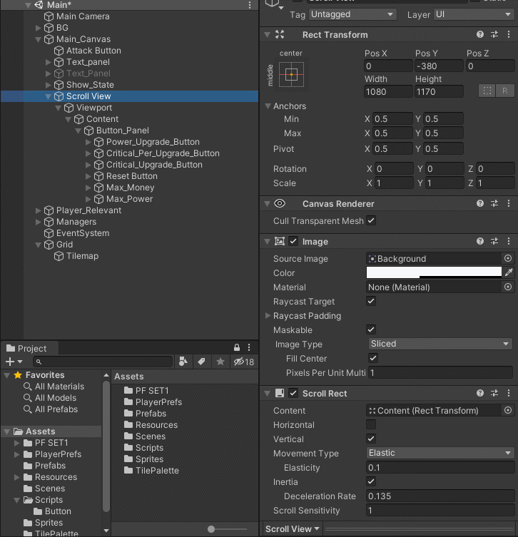
    1. Panel에 Vertical Layout Group설정
    2. Scroll View 생성및 스크롤바 삭제
    3. Content 안에 내용물 삽입
    4. Content, Panel의 크기를 동일한 크기로 설정(크게)
 - ### **item창 구매 화면 변경** 
 - 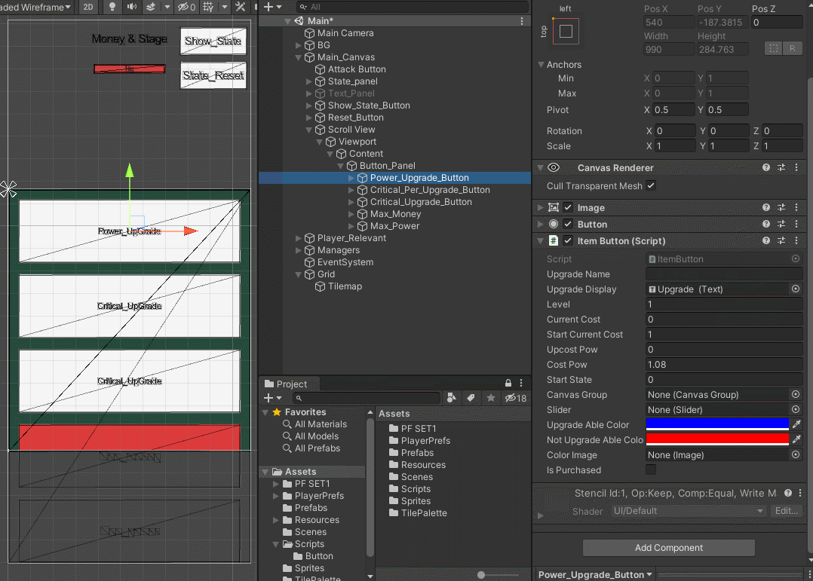
    1. 슬라이더를 블럭에 맞게 추가 슬라이더의 Fill을 이용해서 색을 변경
    2. canvasGroup 추가(Alpha로 투명도 조절)
```c#
slider.minValue = 0;
slider.maxValue = currentCost;

slider.value = DataManager.Instance.gold;

if (isPurchased)    //투명도 조절
{
  canvasGroup.alpha = 1.0f; 
}
else
{
 canvasGroup.alpha = 0.6f;
}

if (currentCost <= DataManager.Instance.gold) 
{
  colorImage.color = upgradeAbleColor;
}
else
{
  colorImage.color = notUpgradeAbleColor;
}
```
> **<h3>Realization</h3>**
 - ### 스크롤 방법
 - ### 버튼 색 채우는 방법
____
## __1.11__
> **<h3>Today Dev Story</h3>**
 - ### 업그레드 창의 호출 및 숨김 구현 (<span style = "color:yellow;">1.애니메이션</span> 2.recttransform) 
 - 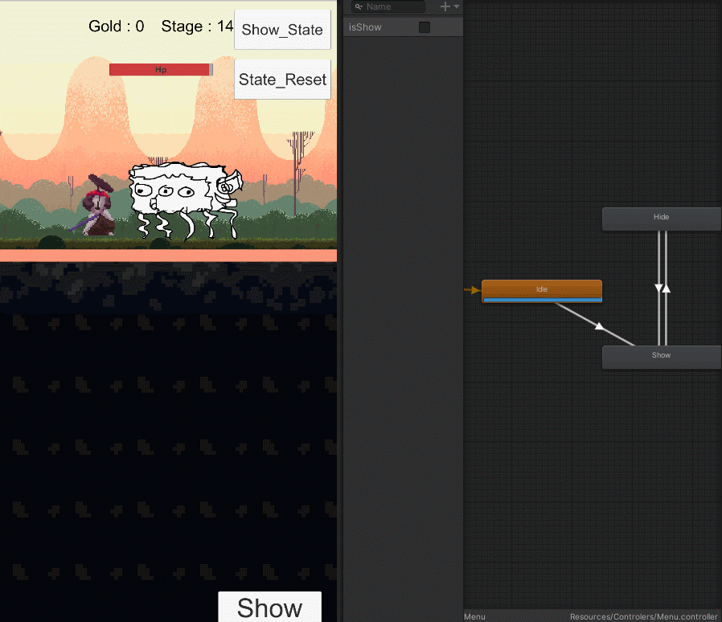
```c#
//애니메이션으로 구현
public Animator ani;
public Text text; 
private bool isshow = false;

public void OnClick()
{
  if (!isshow) //위로 올라옴
    isshow = true;
    ani.SetBool("isShow", true);
    text.text = "Hide";     //text의 변화
  }
  else
  {
    isshow = false;
    ani.SetBool("isShow", false);
    text.text = "Show";
  }
}
```
 - ### DamageText 수정 완료
 - ### 분산되어 있던 GUI함수들을 UIManager에 확장
 - ### 좌우 메뉴 확장 <ins>(c# 간단하게 추후 수정)</ins>
 - 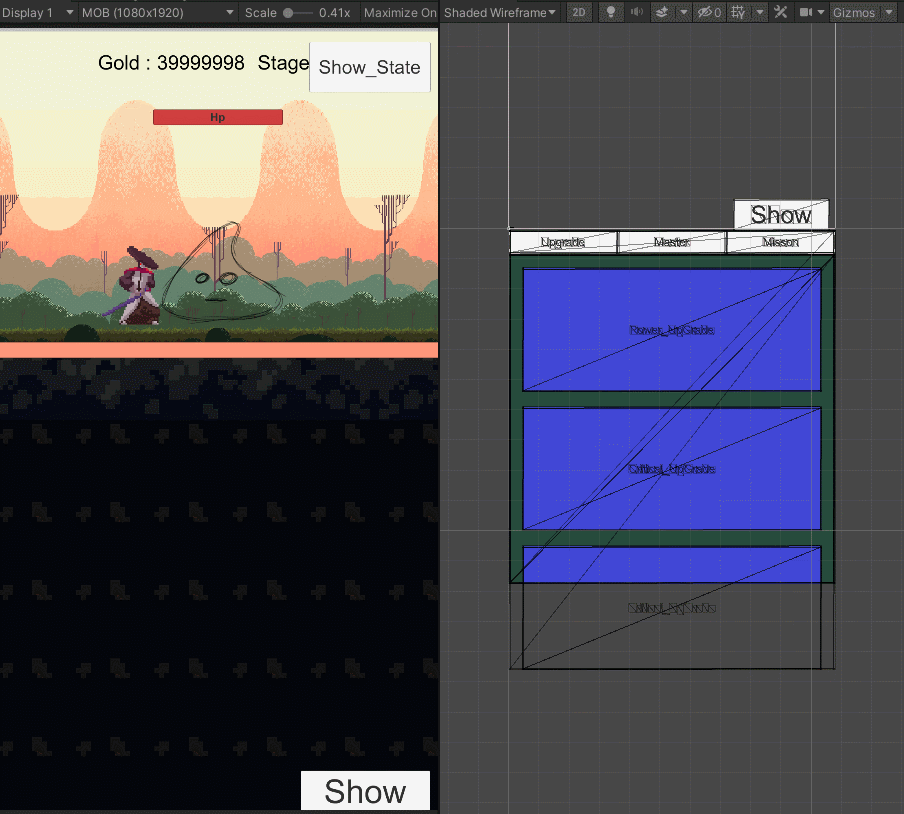
```c#
public void SwitchUpgrade()    //Button창 활성화
{
  UpgradeP.SetActive(true);
  MasterP.SetActive(false);
  MissonP.SetActive(false);
}
public void SwitchMaster()    //Master창 활성화
{
  UpgradeP.SetActive(false);
  MasterP.SetActive(true);
  MissonP.SetActive(false);
}
public void SwitchMisson()    //Misson창 활성화
{
  UpgradeP.SetActive(false);
  MasterP.SetActive(false);
  MissonP.SetActive(true);
}
```
> **<h3>Realization</h3>**
 - ### <span style = "color:yellow;">**Slot에 아이템 추가하는 방법** </span>
    1. 슬롯에 대한 정보 추가  
    ```c#
    [System.Serializable]
    public class SlotData
    {
      public bool isEmpty;
      public GameObject slotObj;
    }
    ``` 
    2. 인벤토리를 List로 생성
    ```c#
    public List<SlotData> slots = new List<SlotData>();
    private int maxSlot = 3;
    public GameObject slotPrefab;

    private void Start()
    {
      GameObject slotPanel = GameObject.Find("Panel");    //Slot을 프립펩화 한후에 Panel아래에 생성할꺼임 그래서 Panel을 찾는거임

      for (int i = 0; i < maxSlot; i++)
      {
        GameObject go = Instantiate(slotPrefab, slotPanel.transform, false);
        go.name = "Slot" + i;
        SlotData slot = new SlotData();
        slot.isEmpty = true;
        slot.slotObj = go;
        slots.Add(slot);
      }
    }
    ```
    3. 조건이 된다면 슬롯에 할당
    ```c#
    Inventory inven = collision.GetComponent<Inventory>();
    for (int i = 0; i < inven.slots.Count; i++)
    {
      if (inven.slots[i].isEmpty) //슬롯에 생성
      {
        Instantiate(slotItem, inven.slots[i].slotObj.transform, false);
        inven.slots[i].isEmpty = false;
        Destroy(this.gameObject);
        break;
      }
    }
    ```
____
## __1.12__
> **<h3>Today Dev Story</h3>**
 - ### Combo창을 만들어 버튼을 누르면 창에 이미지를 삽입 (List사용)
 - ### 버튼 클릭시 slot 하위에 이미지만 생성 <ins>추후 수정(오브젝트 풀링 사용)</ins>
 - 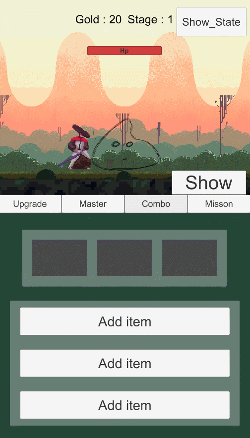 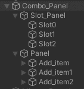
```c#
public class InventoryManger : MonoBehaviour
{
  public List<SlotData> slots = new List<SlotData>(); //List사용
  private int maxSlot = 3;
  public GameObject slotPrefab;
  public GameObject Panel;    //Panel의 setactive를 사용하기 위함

  public void Start()
  {
    Panel.SetActive(true);  //Panel이 활성화 되어 있지 않으면 item창이 생성되지 않아서 켰다가 끄게 만들었다.
    GameObject slotPanel = GameObject.Find("Slot_Panel");
    for (int i = 0; i < maxSlot; i++)
    {
      GameObject go = Instantiate(slotPrefab, slotPanel.transform, false); //미리 공간만 만들어 둔다.
      go.name = "Slot" + i;
      SlotData slot = new SlotData();
      slot.isEmpty = true;
      slot.index = 0;
      slot.additionalD = 0;
      slot.slotObj = go;
      slots.Add(slot);
    }
    Panel.SetActive(false);  
  }
}

[System.Serializable]
public class SlotData   //각 slot의 데이터
{
    public bool isEmpty;
    public int index;           //고유 인덱스 값
    public float additionalD;   //추가 데미지
    public GameObject slotObj;  //넣을 이미지
}

public class ItemAddButton : MonoBehaviour  //아이템추가 버튼 (추후 변경)
{
  public GameObject slotItem;
  public InventoryManger inven;
  public float i_additionalD;   //설정할 추가 데미지 값
  public int i_index;           //설정한 고유 index값

  public void Add()   //추후 오브젝트 풀링으로 변경하자
  {
    for (int i = 0; i < inven.slots.Count; i++)   //빈곳에 넣는다.
    {
      if (inven.slots[i].isEmpty)
      {
        Instantiate(slotItem, inven.slots[i].slotObj.transform, false);
        inven.slots[i].isEmpty = false;
        inven.slots[i].additionalD = i_additionalD; 
        inven.slots[i].index = i_index;
        break;
     }
    }
  }
}
```
 - ### 장착된 Combo에 따른 %데미지 추가(관련 class수정 ItemAddButton,SlotData, InventoryManager)
 -  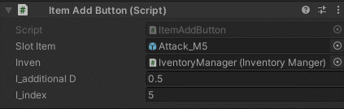
```c#
//AttackButton에 Onclick()함수에 추가된 내용
//Combo 순서대로 공격
if (count == inven.slots.Count)
{
  count = 0;
}
if (inven.slots[count].additionalD != 0)    //0이 아닐때만 실행
{
  n_power += n_power * inven.slots[count].additionalD;
  Debug.Log("@@강화 공격@@"); //삭제
}
count++;
```
 - ### 장착된 Combo 삭제 구현(1,2,3번 클릭)
 - 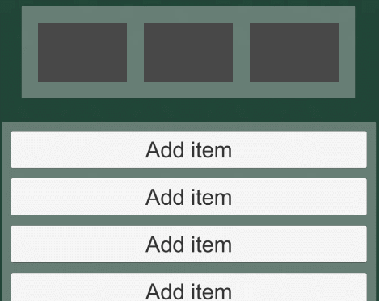
```c#
public class ItemDel : MonoBehaviour  //장착시 생성되는 곳에 들어간다.
{
    private void Update()
    {
        if (Input.inputString == (transform.parent.GetComponent<Slot>().num + 1).ToString())
        {
            Destroy(this.gameObject);
        }
    }
}
public class Slot : MonoBehaviour //Slot 배경에 들어간다.
{
    InventoryManger inventory;
    public int num;
    private void Start()
    {
        inventory = GameObject.Find("InventoryManager").GetComponent<InventoryManger>();    //이렇게 받을 수도 있군 
        num = int.Parse(gameObject.name.Substring(gameObject.name.IndexOf("_") + 1));   //번호 추출
    }
    private void Update()
    {
        if(transform.childCount <= 0)
        {
            inventory.slots[num].isEmpty = true;
        }
    }
}
```
> **<h3>Realization</h3>**
 - ### PreFab화 된 오브젝트를 생성시에 이름을 정하는 방법
   - Instantiate후 obj.name = "~~"으로 설정
 - ### 문자열 자르기 SubString 
   ```c#
   num = int.Parse(gameObject.name.Substring(gameObject.name.IndexOf("_") + 1));   //번호 추출
   ```
 - ### InventoryManager라는 오브젝트를 찾아 InventoryManager(스크립트)를 찾음
    ```c#
    GameObject.Find("InventoryManager").GetComponent<InventoryManger>();
    ``` 
 - ### 본인 오브젝트에서 부모오브젝트중 Slot이라는 것(스크립트 등등)을 찾아 사용
    ```c#
    transform.parent.GetComponent<Slot>().num
    ```
## __1.13__
> **<h3>Today Dev Story</h3>**
 - ### Combo 창 선택시 Scroll View의 Scroll Rect 비활성화하여 스크롤 기능을 멈춤 
    ```c#
    public void SwitchCombo()    //선택하면 Active를 비/활성화 (Misson창)
    {
      UpgradeP.SetActive(false);
      MasterP.SetActive(false);
      ComboP.SetActive(true);
      MissonP.SetActive(false);
      scrollRect.enabled = false; //스크롤 비활성화
      content.anchoredPosition = new Vector2(0, -100);    //초기로 고정해버림
    }
   ```
 - ### Combo에 따른 공격 이미지 변경 <ins>(추후 변경)</ins>
  - 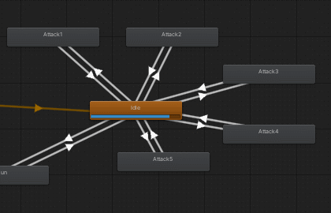

    ```c#
    public void AttackAction(int num)
    {
      switch (inven.slots[num].index) //고유번호 사용
      {
        case 1:
          animator.SetInteger("Attack", 1);
          break;
        case 2:
          animator.SetInteger("Attack", 2);
          break;
        case 3:
          animator.SetInteger("Attack", 3);
          break;
        case 4:
          animator.SetInteger("Attack", 4);
          break;
        case 5:
          animator.SetInteger("Attack", 5);
          break;
        default:
             break;
      }
      StartCoroutine(Wait());
    }
    ```
> **<h3>Realization</h3>**
 - ### 스크립트로 컴포넌트 편집방법
    ```c#
    //추가
    GameObject.AddComponent<찾을 컴포넌트>();
    //삭제
    GameObject a = GameObject.GetComponent<찾을 컴포넌트>();
    Destory(a);
    //비/활성화
    ~~~~.enabled = true (false)
    ```
___
## __1.14__
> **<h3>Today Dev Story</h3>**
 - 공격 system 개발 
    - 3번째 공격시 각 슬롯에 있는 index가 조건에 맞는다면 3번째 공격에 추가 데미지를 발생 <ins>(추후 변경)</ins>
    - Power 계산 부분 함수화 후 분리
    ```c#
    private float sumPower()    //Power 계산하는법
    {
      if (strikePer >= rand)  //크리티컬 공격!
      {
        n_power *= strikePow;  //대안생각하기
        Debug.Log("크리티컬");
      }
      if (count == inven.slots.Count)
      {
        count = 0;
      }
      if (inven.slots[count].additionalD != 0)    //0이 아닐때만 실행
      {
        if (count != 2)  //원래는 3인데 0부터 시작했으니 2가 되야한다.
        {
          n_power += n_power * inven.slots[count].additionalD;
        }
        else        //조건이 맞다면 3타 가능
        {
          Debug.Log("@@3번째 강화 준비@@");
          if (inven.slots[0].index == 1 && inven.slots[1].index ==  2 && inven.slots[2].index == 3)    //못줄이나...?
          {
            n_power += n_power * 3;
            Debug.Log("@@3번째 강화 공격@@"); //삭제
          }
          else if(inven.slots[0].index == 1 && inven.slots[1].index == 2 && inven.slots[2].index == 4)
          {
            n_power = 99999999;
            Debug.Log("@@3번째 강화 공격(즉살)@@"); //삭제
          }
        }
      }
      return n_power;
    }
    ```
> **<h3>Realization</h3>**
 - [소수점 처리 관련](https://dodnet.tistory.com/4406)
 - System.Math.Round(float a, int b) : a의 소숫점을 b 자리 까지 남기고 반올림
___
## __1.15__
> **<h3>Today Dev Story</h3>**
 - 아파
> **<h3>Realization</h3>**
 - null
___
## __1.16__
> **<h3>Today Dev Story</h3>**
 - 늦은 귀가
> **<h3>Realization</h3>**
 - null
___
 ## __1.17__
> **<h3>Today Dev Story</h3>**
 - 공격데미지 소수점처리 
 - 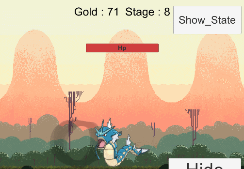
   
   ```c#
   n_power = (float)System.Math.Round(n_power,2); //2자리수까지만 표현
   ``` 
 - [보스를 못잡아도 돈 증가오류 수정](#보스-돈-수정)
 - Combo메뉴에서 다른 메뉴변경 시 스크롤이 안되는 오류 수정
 - Auto Click 구현 (Default -> 1f) <ins>(추후 수정)</ins>
 - 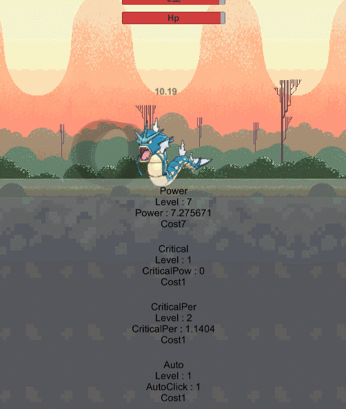
    
    ```c#
    //AttackButton 에 구현
    private void Start()
    {
        StartCoroutine(Auto());
    }
    IEnumerator Auto()  //자동 클릭
    {
      while (true)
      {
        OnClick();
        yield return new WaitForSeconds(DataManager.Instance.AutoC);
      }
    }
    ```
    ```c#
    //다른 Buttons를 상속받은 버튼과 동일하다. 감소되는 정도만 다르다.(고정) ->AutoClickButton의 내용
    DataManager.Instance.AutoC -= costPow;    //감소 0.05f

    //DataManager에 추가된 내용
    [HideInInspector]
    public float AutoC  //자동 클릭 시간
    {
      get
      {
        return PlayerPrefs.GetFloat("auto", 1f);
      }
      set
      {
        PlayerPrefs.SetFloat("auto", value);
      }
    }
    ```
 - 애니메이션 작성 및 수정 <ins>(추후 수정)</ins>
 - 
> **<h3>Realization</h3>**
 - null
___
## __1.18__
> **<h3>Today Dev Story</h3>**
 - ## 밸런스패치 진행
 - Power_level이 10상승할때 마다 0.2f씩 공격력 증가하는 폭이 상승, 또한 Power 증가함수를 제거
    ```c#
    if (DataManager.Instance.gold >= currentCost)
    {
      DataManager.Instance.gold -= currentCost;
      DataManager.Instance.power += costPow;    //수정
      DataManager.Instance.SavePowerButton(this); 

      level++;
      if (level % 3 == 0)
      {
        UpdateItem();
      }
      if (level % 10 == 0) //10레벨마다 증가하는 폭 증가
      {
        costPow += 0.2f;
      }
    }
    ```
  - [골드 증가 수정 진행](#골드-증가-수정(10stage마다)) 
    ```c#
    //UIManager 내용
    if (!EnemyManager.Instance.getExist()) //몬스터 뒤짐
    {
      DataManager.Instance.goldPerTake++; //골드 개수 증가
      break;
    }
    ```
> **<h3>Realization</h3>**
 - Awake
   - 초기화 함수. 가장 먼저 호출
 - OnEnable
   - 게임 오브젝트가 활성화 될때 마다 호출
 - Start
   - 게임 시작 후, 첫번째 프레임 시작전 Update 직전에 한번 호출
 - Update
   - 게임 오브젝트가 활성화 되어 있을때 매 프레임 마다 호출
 - LastUpdate
   - 게임 오브젝트가 활성화 되어 있을대 Update후 매 프레임 마다 호출
 - FixedUpdate
   - 게임 오브젝트가 활성화 되어 있을때, 설정된 고정 시간 주기로 호출
   - 고정시간 간격 : Edit -> ProjectSetting -> Time -> Fixed Timelep
 - OnDisable
   - 게임 오브젝트가 비활성화 될 때 마다 호출
   - Update가 호출되지 않음.
   - 다시 활성화 하면 OnEnable부터 호출됨
 - OnDestroy
   - 게임 오브젝트가 삭제될때 호출
 - Invoke
   - 타이머 대신 유니티의 MonoBehaviour에서 제공 하는 함수
   -  Invoke("함수이름", 시간)
 - InvokeRepeating
   - 최초 실행 시간 설정 이후, 반복 시간 설정이 가능한 함수
   - InvokeRepeating("함수이름", 최초 실행 시간, 반복 실행 시간)
 - CancelInvoke
   - 설정된 Invoke가 모두 취소됨
 - OnTriggerEnter
   - Trigger 속성이 True 게임 오브젝트가 충돌 하는 순간 호출
 - OnTriggerStay
   - Trigger 속성의 오브젝트가 충돌후 충돌 해제가 되기 전까지 매 프레임 마다 호출
 - OnTriggerExit
   - Trigger 속성의 오브젝트가 충돌해제될때 호출
___
## __1.19__
> **<h3>Today Dev Story</h3>**
 - ## 밸런스패치 진행
 - Enemy Hp 패치
   - **EnemyManager**에서 Hp를 관리해주며 Mathf.Pow()를 사용해 기하급수적 증가를 이룸
   - **Enemy**에서 ifdead()가 활성화 되었을때 Hp,MaxHp를 증가시킨다.
   - Boss 잡지 못했을때 **DataManager**에서 DecreaseStage()를 통해 Hp와 fixHp감소
    ```c#
    //EnemyManager.cs
    private float n_Hp = 0f;
    private float HpPow = 0.4f; //제곱비
    ///////////////////////
    public float defineHp()
    {
      n_Hp = DataManager.Instance.Hp;         //시작할때 불러온다.
      if (DataManager.Instance.stage % 10 == 0 && isBoss == false)  //10단위 stage라면 보스 출현
      {
        isBoss = true;
        Debug.Log("@@@@@Boss 출현@@@@@");
      }
      if(DataManager.Instance.stage % 10 == 1)
      {
        DataManager.Instance.subHp = n_Hp;
        Debug.Log("저장" + DataManager.Instance.subHp);
      }
      n_Hp += DataManager.Instance.fixHp * Mathf.Pow(DataManager.Instance.fixHp, HpPow / DataManager.Instance.stage); //수정해야함
      return n_Hp;
    }
    ```
    ```c#
     //Enemy
    public void ifdead()    //일반 몬스터가 죽을때
    {
      r_gold = Random.Range(DataManager.Instance.goldPerTake, DataManager.Instance.goldPerTake + 2);   //+1까지만 지원
      DataManager.Instance.gold += r_gold;    //추후 추가
      DataManager.Instance.stage++;
      EnemyManager.Instance.setExist(false);

      //Hp 관련
      DataManager.Instance.Hp = maxHP;
      DataManager.Instance.fixHp += 5;    //Hp 증가
      Destroy(this.gameObject);
    }
    ```
    ```c#
    //DataManager.cs 
    public float subHp  //보스를 잡지 못했을 때 HP를 줄이기 위한 용도
    {
      get { return PlayerPrefs.GetFloat("subHp", 0f); }
      set { PlayerPrefs.SetFloat("subHp", value); }
    }
    public float fixHp  //5씩 증가하는 계산 용도
    {
      get { return PlayerPrefs.GetFloat("fixHp", 5f); }
      set { PlayerPrefs.SetFloat("fixHp", value); }
    }
    public float Hp //실질적으로 관련
    {
      get { return PlayerPrefs.GetFloat("Hp", 0f); }
      set { PlayerPrefs.SetFloat("Hp", value); }
    }
    /////// -->예외적으로 줄어드는 관리
    public void DecreaseStage()
    {
      stage -= 9; //스테이지 감소

      //몬스터 Hp감소
      Hp = subHp;
      fixHp -= 45;
    }
    ```
 - GUI 수정 
   - 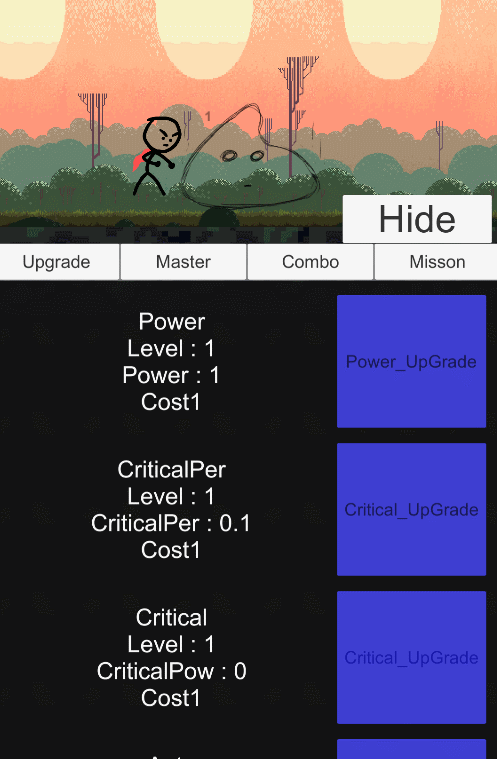
   - 배치수정, 상태표시 창 삭제 // 업그레이드 창에서 현제 상태 확인 가능
> **<h3>Realization</h3>**
 - null
___
## __1.20__
> **<h3>Today Dev Story</h3>**
 - ### 최초 업글시 투명도를 상승시켜 구매한것과 하지 않은것에 대해 구분
    - 
    ```c#
    //PowerButton
    private void OnEnable() //오브젝트 활성화시
    {
      if (DataManager.Instance.power != 1)    //투명도 조절위함
      {
        isPurchased = true;
      }
    }

    public override void PurchaseUpgrade()
    {
      //if구문->돈빼고(자동저장)
      if (DataManager.Instance.gold >= currentCost)
      {
        isPurchased = true; //추가
        DataManager.Instance.gold -= currentCost;
        DataManager.Instance.power += costPow;  //수정
        DataManager.Instance.SavePowerButton(this);
        level++;
        if (level % 3 == 0)
        {
          UpdateItem();
        }
        UpdateUI();
        if (level % 10 == 0) //10레벨마다 증가하는 폭 증가
        {
          costPow += 0.2f;
        }
      }
    }
   ```
 - ### AutoClick밸런스
    ```c#
    float startCurrentCost = 10f;
    float UpcostPow = 1.3f;
    float currentCost = 10f;
    int level = 1;
    public void test()
    {
      currentCost = startCurrentCost * Mathf.Pow(UpcostPow, level);
      Debug.Log(level + " : " + currentCost);
      level++;
    }
   ```
> **<h3>Realization</h3>**
 - null
___
## __1.20__
> **<h3>Today Dev Story</h3>**
 - Misson, 스킬다양화
> **<h3>Realization</h3>**
 - null